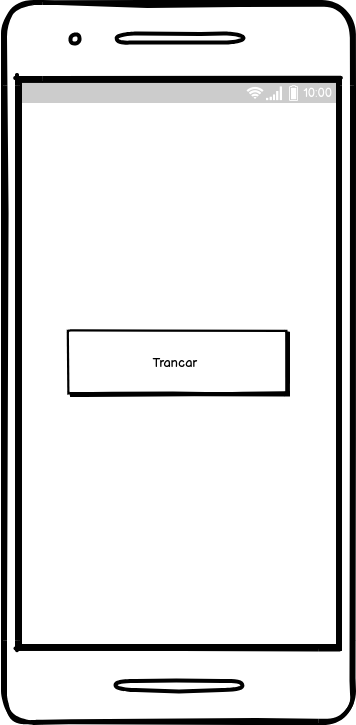
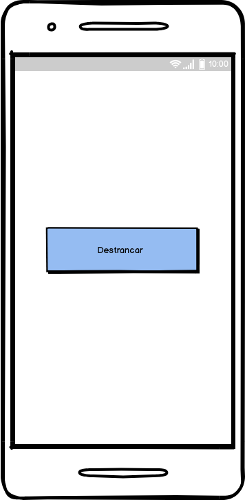

# Documento de Visão do Projeto Open Door

Este documento apresenta uma solução de hardware e software para o projeto *Open Door*, 
nesse projeto iremos fazer uma tranca automatizada para fechaduras de portas normais, 
que receberá os comandos de trancar e destrancar a porta, via comandos recebidos por 
requisições REST e/ou bluetooth. As requisições REST serão recebidas via um módulo Wi-Fi.

## Objetivos

* Trancar e destrancar uma porta a distancia
* Ultilizar a internet para conectar a pessoa com a segurança de sua casa
* Informar o status das portas por aplicação web/mobile

## Problema

* Descrição do problema: Pessoas esquecem suas chaves ou ficam trancadas dentro ou fora dos ambientes
* Quem é afetado pelo problema: Normalmente adolecentes, parentes que estão como visitas, etc

## Funcionalidades do produto

* Trancar porta
* Destrancar porta
* Informar situação de porta

## Restrições do projeto

* O aparelho precisa estar conectado em alguma rede WiFi para receber os comandos

## Protótipos

