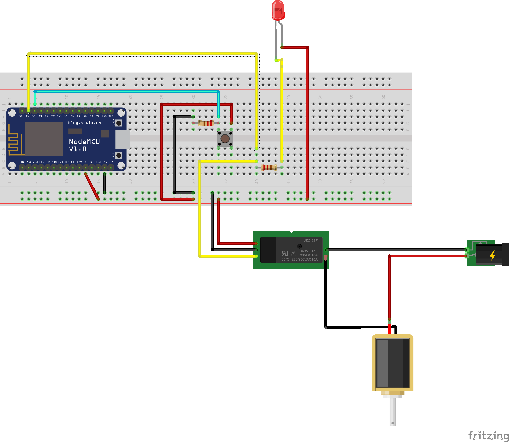
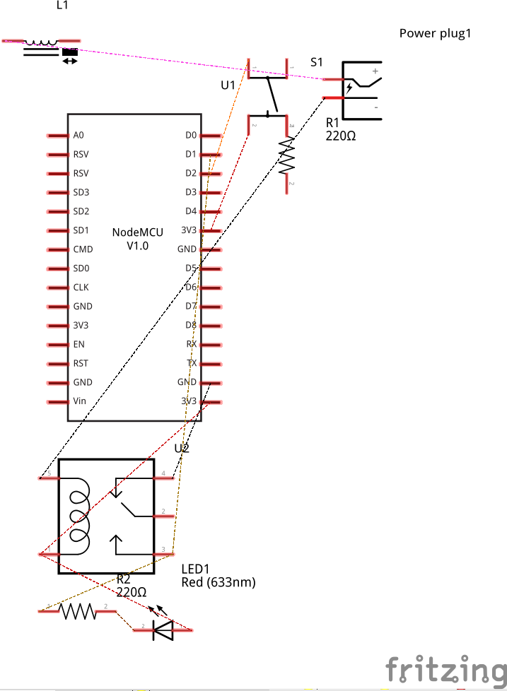

# Descriçao do Hardware

Deve conter:

1) Lista de Peças 

	01 – ESP8266 Node MCU

	01 – Mini Trava Solenoide

	01 – LED verde

	
	01 – Botão push

	10 (em media) - conectores machos e femeas

	01 – Fonte 12v

	02 – Resistores Resistor 10kΩ

	01 – Módulo relé 5V

2) Desenho Tinkercad ou Fritzing

3) Esquema eletrônico

4) Materiais para confecção de caixas e consoles (ou arquivos para impressão 3D)
