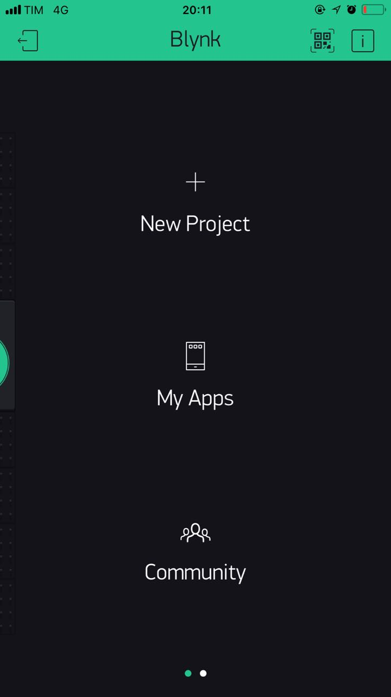
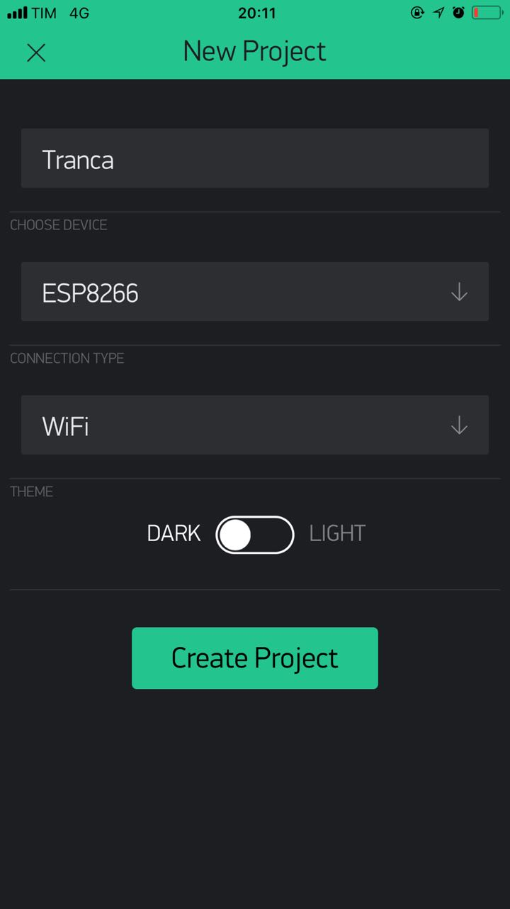
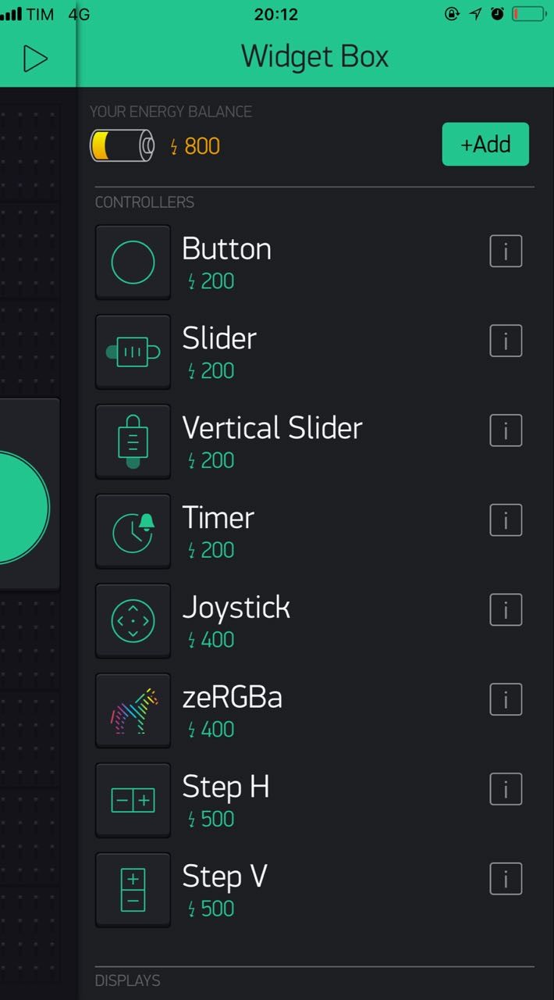
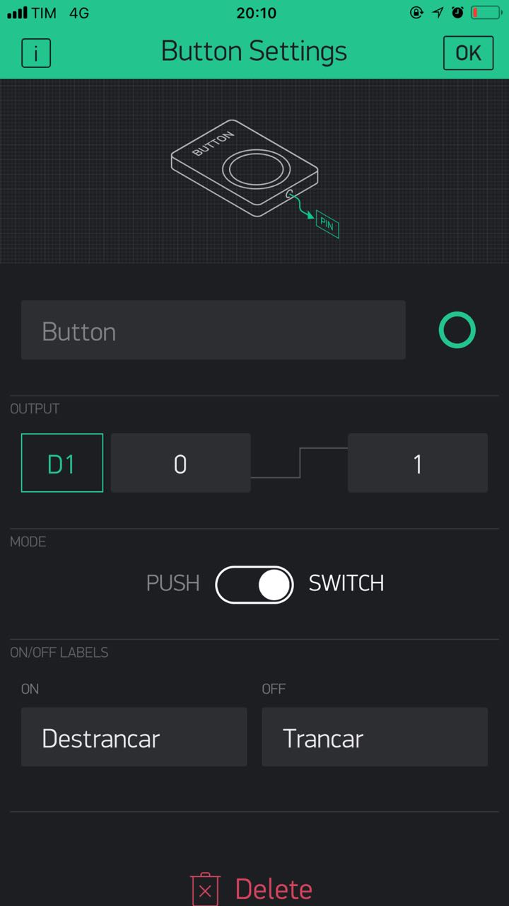
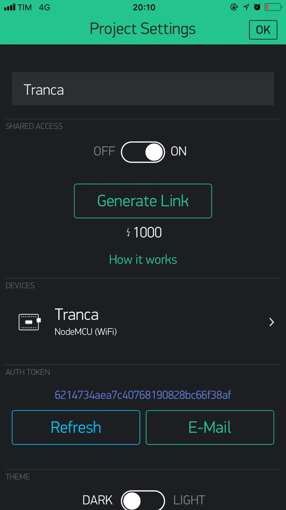
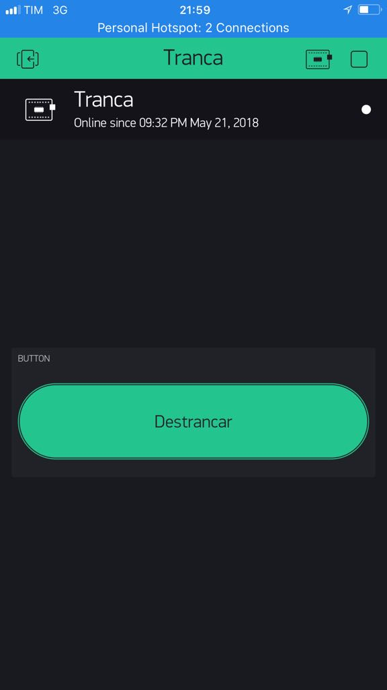

# Nesta seção devem ser descritas:
1. Interfaces de rede utilizadas (shield GPRS, Ethernet, Modulos Wifi, etc)
    Utilizamos no projeto um NodeMCU com o modulo ESP8266

2. Protocolos (Firmata, MQTT, CoAP, HTTP, etc)
    Nesse projeto optamos por utilizar o Blynk como interface para conectar nosso NodeMCU com a aplicação Web, o Blynk utiliza os protocolos tcp/ip comuns via HTTP, não sendo necessario mais nenhum tipo de protocolo para a comunicação dos dispositivos.

3. Descrição de aplicativos desenvolvidos, dashboards, IHM e demais interfaces com o usuário desenvolvidas (layouts e moockups)
    Utilizamos no projeto o Blink, que é uma plataforma para criar apps IoT. 

# Interface:

1. Baixe o app Blynk no seu dispositivo, ao abrir o app selecione a opção apra criar um novo projeto (como na imagem):

2. De o nome do projeto (pode ser qualquer um), selecione o Dispositivo ("choose device") que irá usar (no nosso caso o ESP8266):

3. Pronto, aprimeira etápa do app já está feita, agora precisamos adicionar um botão ao projeto, abra o menu lateral e adicione um botão ("Button") na tela:

4. Após adicionar o botão, precisamos configurar as entradas do nosso pino (de acordo com a imagem):

5. Após configurar já temos tudo pronto basta copiar o auth code (assim com na tela) e utiliza-lo no código do arduino.:

##Imagem do APP

##Link Compartilhavel do APP
